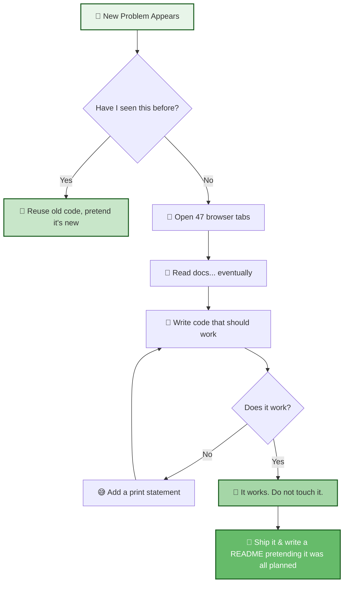

<!-- ====================================================== -->
<!--            NEHA JAKATE — GREEN THEME PROFILE           -->
<!-- ====================================================== -->

<p align="center">
  
</p>

<p align="center">
  
</p>

<p align="center">
  <a href="https://github.com/NEHAJAKATE"></a>
  <a href="https://www.linkedin.com/in/neha-jakate/"></a>
  <a href="mailto:nehajakate94@gmail.com"></a>
</p>

<p align="center">
  
  
  
</p>

<h3 align="center">🌿 a little garden of code, growing one commit at a time 🌿</h3>

---

## 🍃 About This Garden

```
🌱 seed        →  Final Year Computer Engineering Student
🌿 sapling     →  AI Systems Engineering Intern
🌳 growth ring →  Agentic AI · Enterprise AI · Computer Vision
🍂 falling     →  bugs, occasionally. i pick them back up.
🌤️ climate     →  best served with dark mode and good coffee
```

> fun fact: my code has more `try/except` blocks than my actual life decisions.

---

## 🌱 How I Actually Solve a Problem

*(a completely accurate, zero-exaggeration diagram of my process)*



---

## 🌿 Tech Stack — What's Growing in This Garden

<p align="center">
  
</p>

<table align="center">
<tr>
<td valign="top" width="50%">

**🌸 AI & Machine Learning**
```
LangChain · LangGraph · RAG
ChromaDB · OpenCV
Computer Vision · LLMs
Prompt Engineering
```

</td>
<td valign="top" width="50%">

**🌼 Currently Watering**
```
Apache Iceberg · Apache Kafka
DuckDB · AI Agents
Context Engineering
Enterprise Data Platforms
```

</td>
</tr>
</table>

---

## 🌳 Featured Projects (a.k.a. My Prize Tomatoes)

<table>
<tr><th align="left">🍅 Project</th><th align="left">What It Actually Does</th></tr>
<tr><td>🕸️ <b>SpiderBrain</b></td><td>Enterprise AI platform for intelligent business workflows — no actual spiders were harmed</td></tr>
<tr><td>🧠 <b>Brain Hunt</b></td><td>AI-powered assessment & evaluation platform that judges you (kindly)</td></tr>
<tr><td>📊 <b>Customer Data Platform</b></td><td>Enterprise-scale identity & data platform — it knows things</td></tr>
<tr><td>📧 <b>JobMatchMail</b></td><td>RAG-powered cold emails so you don't have to sound desperate manually</td></tr>
<tr><td>🚁 <b>Autonomous Drone Systems</b></td><td>CV + MAVLink + Embedded AI — flies better than I parallel park</td></tr>
<tr><td>🤖 <b>AI Robotic Arm</b></td><td>Vision-guided arm with motion prediction — has better aim than me</td></tr>
</table>

> 🌱 pin your best 4-6 of these on your profile (Customize your pins) and link each to its real repo — a clickable proof beats a cute description every time.

---

## 🌻 Open Source Journey

```text
🌿 contributing to: LangChain · FastAPI · Next.js
🍃 exploring: OpenTelemetry · Apache Ecosystem · Developer Tools
```

**🎯 What I'm growing toward**
```
🌱 50+ meaningful open-source contributions
🌿 Google Summer of Code
🌳 shipping OSS that outlives my commit history
🌸 becoming a long-term maintainer, not a drive-by contributor
```

---

## 🍀 Highlights (My Trophy Shelf of Tiny Plants)

🏅 KPIT Sparkle Finalist
🥈 Trae AI Hackathon Runner-Up
🎓 CGPA 9.86 / 10
🌍 Open Source Contributor
🚀 Preparing for Google Summer of Code

---

## 🌱 GitHub Analytics — Watch It Grow

<p align="center">
  
  
</p>

<p align="center">
  
</p>

<p align="center">
  
</p>

<p align="center">
  
</p>

---

## 🌸 A Very Serious Growth Meter

```
Skills planted    ████████████████░░░░  80%
Bugs squashed     ██████████████░░░░░░  70%
Coffee consumed   ████████████████████ 100% (rounding down, generously)
Open source karma ████████░░░░░░░░░░░░  40% — actively watering this one 🌱
```

---

## 🌳 2026–2027 Roadmap

- ✅ Build Enterprise AI Products
- ✅ Contribute to High-Impact Open Source
- ✅ Publish Production-Ready Projects
- ✅ Master Distributed Systems
- ✅ Become a Google Summer of Code Contributor
- ✅ Build AI Infrastructure
- 🌱 Keep this README from becoming outdated (the hardest goal of all)

---

## 🍃 Engineering Philosophy

> Build products, not just projects.
> Design systems that scale, not just systems that survive the demo.
> Learn deeply, water often.
> Contribute back — a garden nobody shares isn't a garden, it's a hobby.

---

<p align="center">
  
</p>

<h3 align="center">🌱 thanks for stopping by my garden — water your own code today 🌱</h3>
